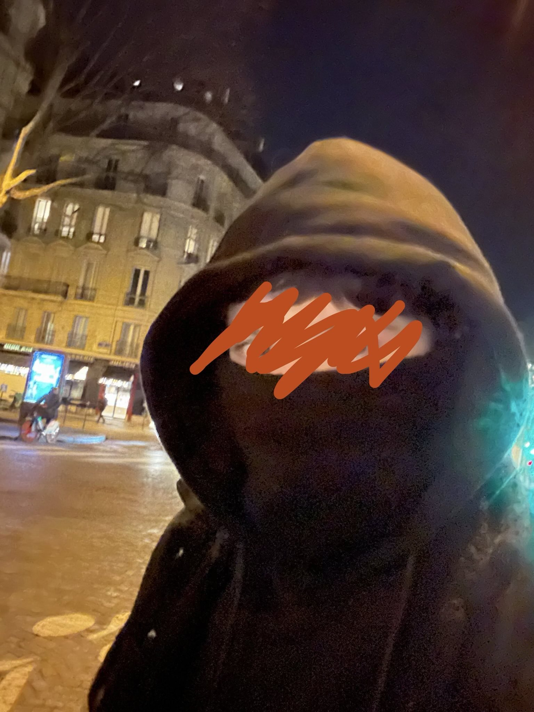
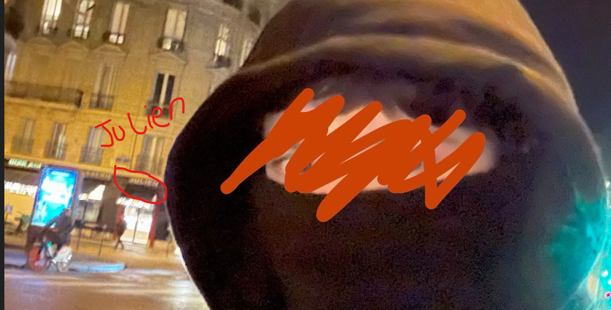
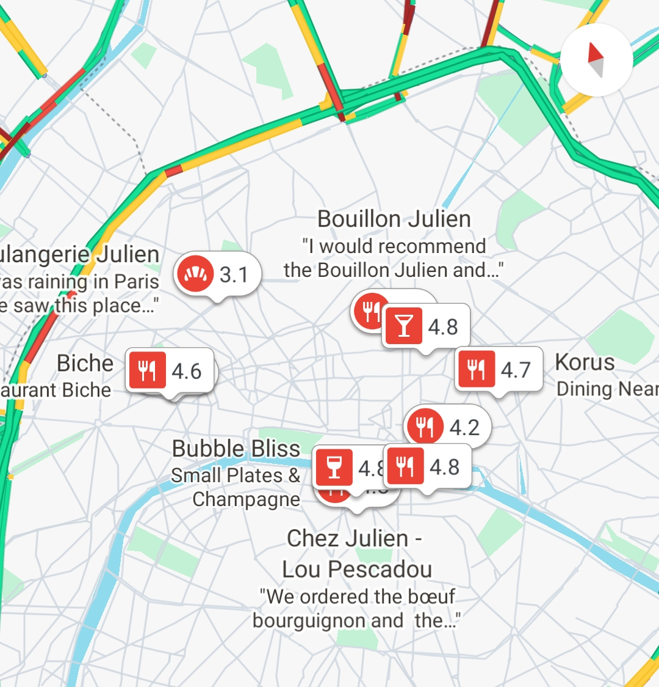
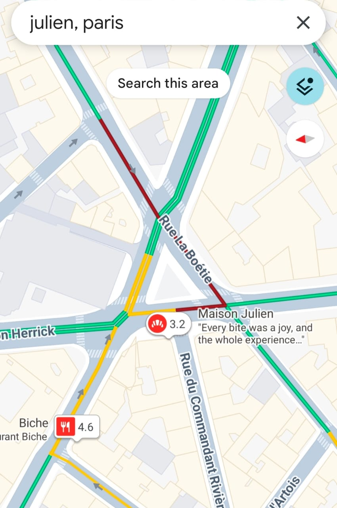
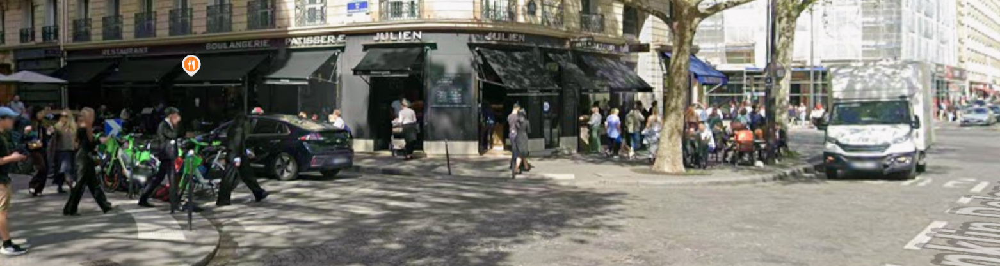
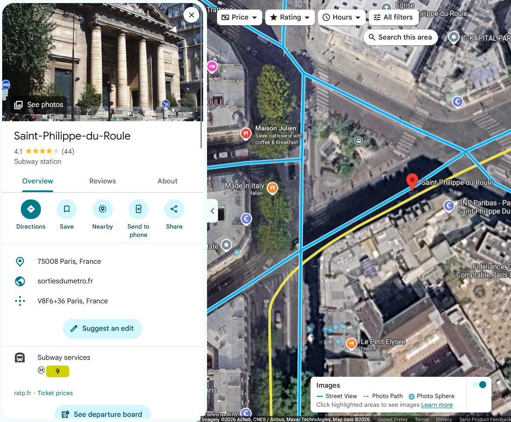

# Masked Man

**Platform:** OSINT Industries  
**Category:** GEOINT 
**Difficulty:** Easy  
**Date Solved:** 25-09-2026
**Tools used:** Google Maps, Google Street View

---

## Challenge Objective

Your objective is to determine the closest metro station to the photographed location, using only the contextual and visual clues provided.

---

## Information Provided

<p align="center">
  
</p>

The image was taken on December 3rd, 2023
The approximate time was 18:00 (early evening)
The location is in Paris, within a central and upscale area
The scene is located near the intersection of a Rue and an Avenue

---

## Initial Analysis

I looked for unique identifiers such as visible text, shop or restaurant names, street signs, architectural features, and other distinctive structures that could help narrow down the location.

---

## Investigation

### Finding Clues


Upon searching for clues, I came across a piece of text on a building that was just barely visible.

<p align="center">
  
</p>

```text
JULIEN
```

The challenge also explicitly mentioned the location was in Paris.

---

### Searching for the location

After identifying the clues, I searched for the text I saw on the building along with "Paris" to narrow the search in Google Maps.

<p align="center">
  
</p>

Then I zoomed into each search location to find a intersection point of an Avenue and a Rue, as specified by the challenge. 

One location 
```text
Maison julien
```
stood out, with an intersection of an Avenue and a Rue.

<p align="center">
  
</p>

Next I switched to satellite view to find any visible comparison of the top view and the given image. The tree and zebra-crossing in Google Maps seemed to match the tree and zebra-crossing I could see in the image. I was convinced that I must've found the location due to clues matching the information.

---

### Verification

After I suspected the location, I investigated it using Google Street View. The building on street view was evidently the same, and I spotted the same piece of text I saw as a initial clue. As well as noticed the same structural identifiers I had noted from the image provided by the challenge.

<p align="center">
  
</p>

---

### Capturing the flag

Once I verified and confirmed the location in the challenge image, I zoomed out near the location on google maps and spotted a metro station right across the street.

<p align="center">
  
</p>

The challenged was solved and using the format given by the CTF platform, the final flag I captured was

```text
OSINT{SAINT_PHILIPPE_DU_ROULE}
```
