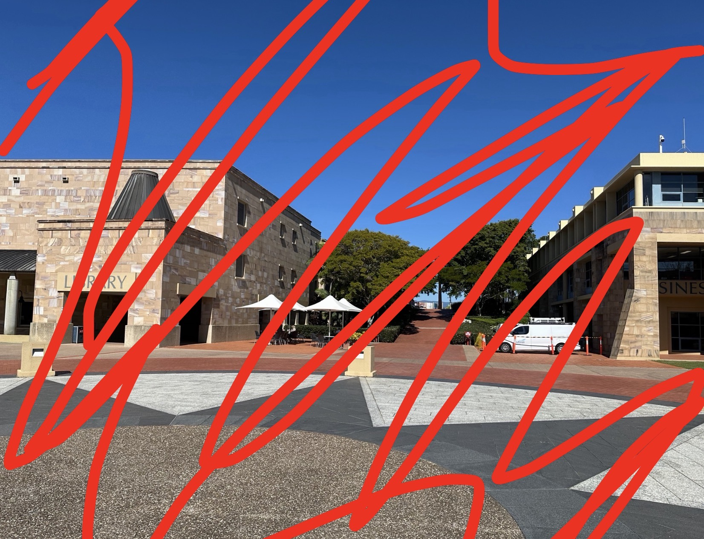
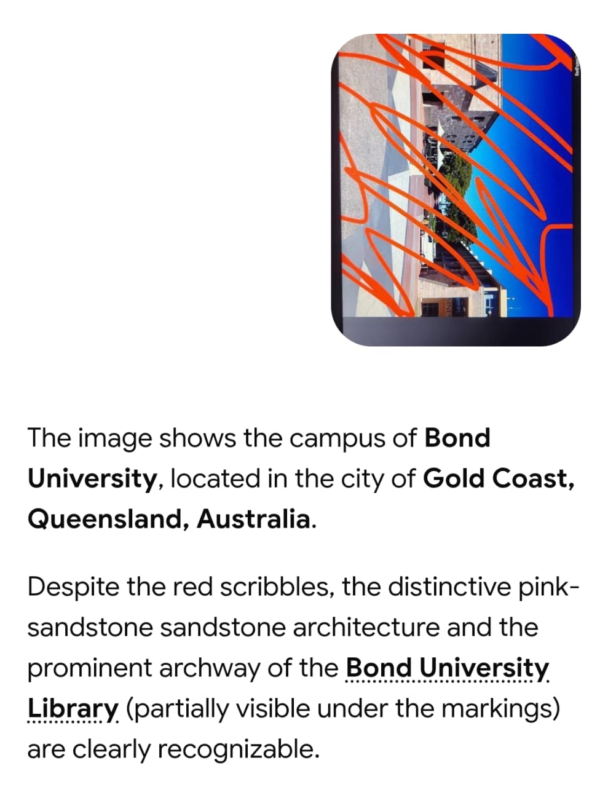
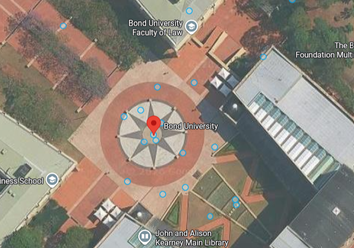

# Caught in the Act 

**Platform:** OSINT Industries  
**Category:** GEOINT 
**Difficulty:** Easy  
**Date Solved:** 25-09-2026
**Tools used:** Google Lens, Google Maps, Google Street View

---

## Challenge Objective

Your objective is to determine:

- The name of the university where the photo was taken
- The city in which it is located

---

## Information Provided

<p align="center">
  
</p>

---

## Initial Analysis

The given image had to be analyzed first. Then I would decide on a move.

---

## Investigation

### Finding Clues


The image shows the university blocks with big letters "LIBRARY" and possibly "BUSINESS" can easily be spotted. The architecture seems to be of sandstone and the flooring has a pattern that may be used for verification. There were no proper giveaways to find the location.

---

### Searching for the location

My best shot was to perform a reverse image search using google lens.

<p align="center">
  
</p>

The results gave me 
```text
Bond University
```
and
```text
Gold Coast
```

---

### Verification

After the search results, I went to google maps in satellite mode to verify the structures and pattern.

The pattern can be compared from the image and the google map result. They seem similar.

<p align="center">
  
</p>  

Next I went to street view to have a better view at the infrastructure.

<p align="center">
  
</p>  

The same straight path, tents to the left, pattern on the floor and the library on the left can be easily compared. This verified the location.

---

### Capturing the flag

Once I verified and confirmed the location in the challenge image, I zoomed out in Google Maps and found the city in which the university was located:

```text
Robina
```

The challenged was solved and using the format given by the CTF platform, the final flag I captured was

```text
OSINT{"bond_university_robina"}
```
