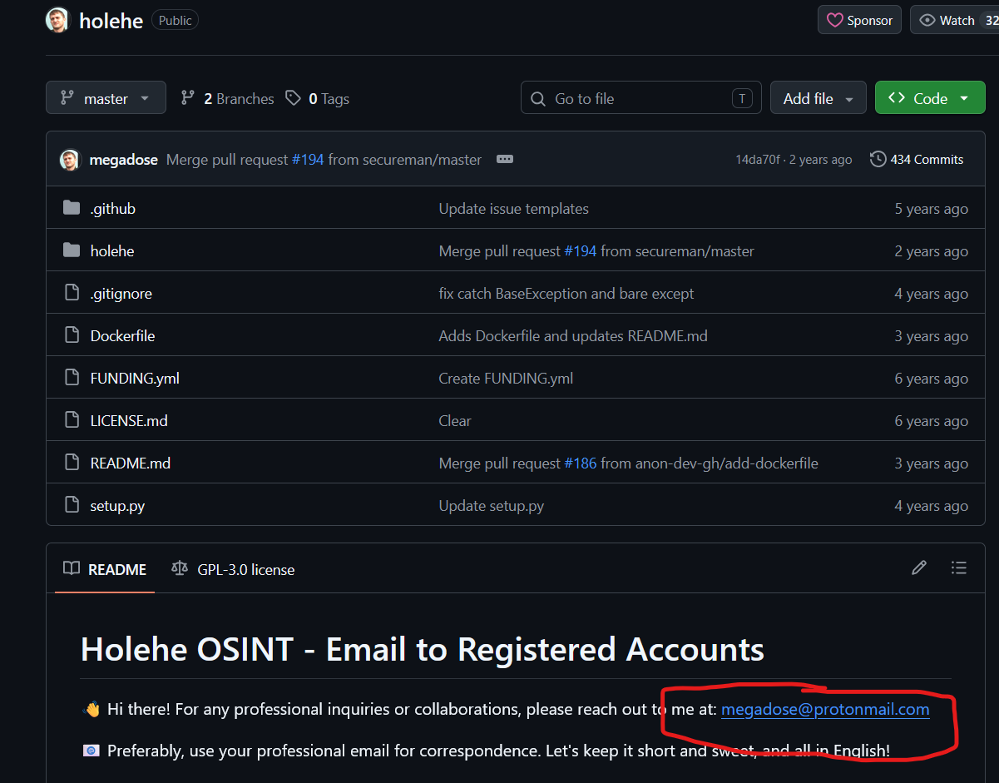
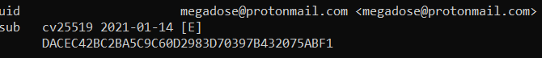

# HOLEHE & THE SECRET EMAIL

**Platform:** OSINT Industries  
**Category:** OSINT
**Difficulty:** Easy-Medium  
**Date Solved:** 25-09-2026
**Tools used:** Google, Windows Command Prompt (CURL and GPG pre-installed)

---

## Challenge Objective

Using open-source intelligence only, find:

- The creator of Holehe
- The public email address used for Holehe
- The exact creation date of this email address

The final flag must be based only on this date.

---

## Information Provided

You are investigating the origins of a popular OSINT tool used to pivot from email addresses to online accounts: Holehe.

Behind every tool, there is a creator — and behind that creator, there is an email address.

---

## Initial Analysis

The first thing I did was search up "Holehe" on google.

---

## Investigation

### Finding the creator

The topmost search results were a Holehe website for OSINT, and a github repository for Holehe. 

<p align="center">
  
</p>

I first visited the website, and tried to find the creator's username but in vain. The website also had OSINT features for usernames, phone numbers and IP addresses. This didn't seem the match the description given in the challenge, which made me highly doubt that the creator I was looking for made this site.

I then moved onto the github repository. The README gave information about an OSINT tool used to pivot from email addresses. This matched the description given in the challenge. I went to the profile straightaway, which showed me the username and name of the creator
```text
Palenath
```

<p align="center">
  
</p>

This was then verified by quick google searches.

---

### Finding the email

I then went to the Holehe repository and scrolled down to see if the creator mentioned any contact details. Luckily, the creator did mention their email address right towards the top of their README file. After going through the entire README file, I confirmed that this was the only email mentioned by the creator as a contact in the repository.

This meant the email of the creator was probably the one and only one in the README file.

<p align="center">
  
</p>

The email in the repository was
```text
megadose@protonmail.com
```

---

### Finding the creation date

Once I found the email, I made a simple google search, "When was megadose@protonmail.com created?", which gave me
```text
Megadose@protonmail.com was created on January 14, 2021.
```

To verify this, I used proton's PGP public API to get the public key of the email using
```text
curl -s "https://mail-api.proton.me/pks/lookup?op=get&search=megadose@protonmail.com" -o holehe.asc
```
in my Windows Command Prompt.

Then I extracted and inspected the key information using
```text
gpg --show-keys holehe.asc
```
in my Windows Command Prompt.

This verified the initial data I got from google search.

<p align="center">
  
</p>

Hence, the verified date of creation of Megadose@protonmail.com was
```text
14-01-2021
```

---

### Capturing the flag

After verifying the date with the email account's public PGP key, I obtained the flag, which was the date of creation.

The challenged was solved and using the format given by the CTF platform, the final flag I captured was

```text
OSINT{14-01-2021"}
```
