# Missing Person

**Platform:** TryHackMe  
**Category:** OSINT   
**Difficulty:** Easy-Medium
**Date Solved:** 27-09-2026  
**Tools used:** Exiftool, Google, Google Maps

**PLEASE NOTE:** This is is a very detailed write up on the methodology and findings I used and came across while doing this challenge. Every flag was found according to the challenge requirements.

---

## Challenge Objective

**What is the commercial name of this circuit?**  
Format: English, full commercial name.

**When did the event take place?**  
Format: DD-DD/MM/YYYY.

**He told me he ate delicious Mexican food. What is the name of the restaurant?**

**At what time was this photo taken?**  
Format: HH:MM:SS.

```text
He sent me a message, this is the last I heard from him: ”Went to this cool MotoGP after party, and became friends with one of the local DJs who played that night. We’re going to visit a cave tomorrow.”
```
**What is the full address of the bar’s location?**

**What is the DJ's stage name?**

**After digging into the DJ's other online accounts, what cave does he take tourists to?**

**What number did the DJ list for his tour business?**  
Format: Full number, no country code.

---

## Information Provided

"My friend went on holiday in 2025 and shared some photos, but I haven’t heard from him since. Can you help me track him down for the police report?"

Download the zip file attached to this task and start your investigation!

```text
Contents of zip file were 2 images
```

<p align="center">
  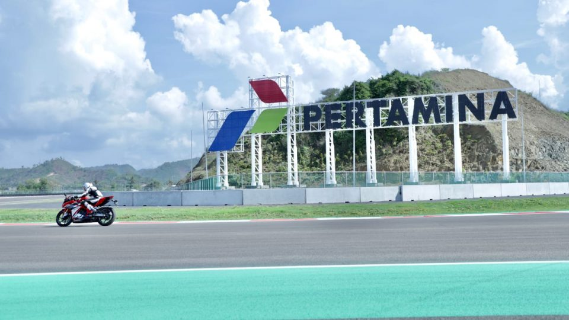
</p>


<p align="center">
  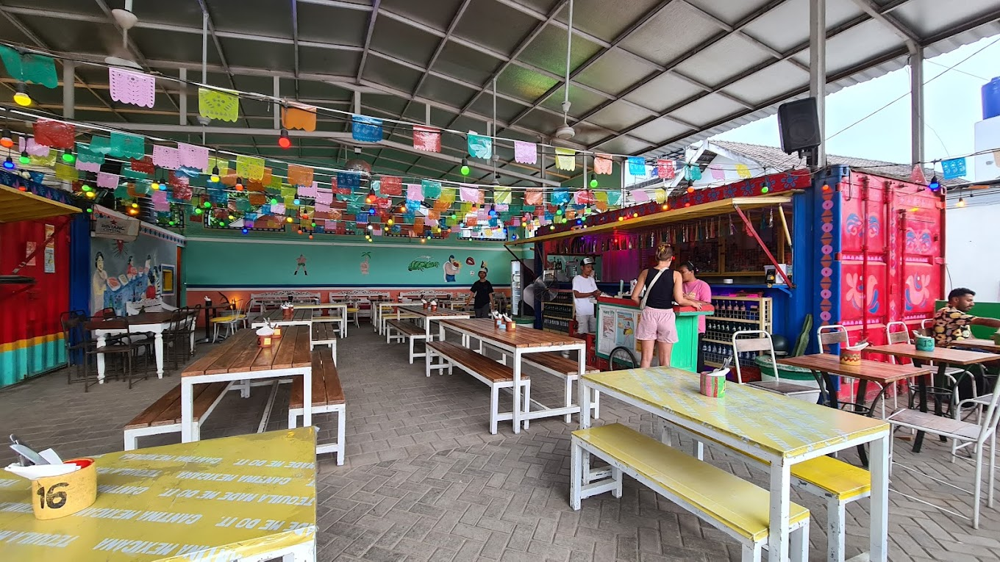
</p>


---

## Initial Analysis

I first opened the MotoGP image file, because it corresponded with the first flags.

---

## Investigation

### Flags 1 and 2


The file name "MotoGP" was the initial clue on what I would be looking for, MotoGP stands for "Motorcycle Grand Prix". Using Google, I searched for "PERTAMINA MotoGP", "PERTAMINA" comes from the text in the given image. The search had a vast range of results that I would have to filter through.

My next thought was to use Exiftool to see if the image metadata contained the image creation date, which would narrow down what exactly I would be looking for, and it did.

<p align="center">
  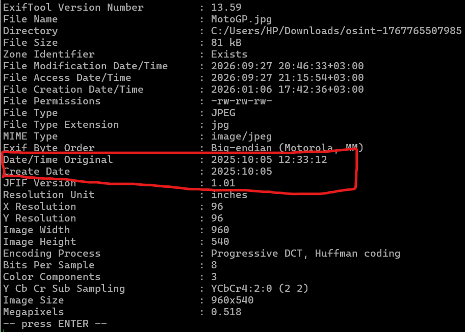
</p>

```text
2025:10:05
```
Now I narrowed down my search using this clue.

Next I searched for "MotoGP circuit 2025". This gave me a site that tracked the schedules for the 2025 races.

<p align="center">
  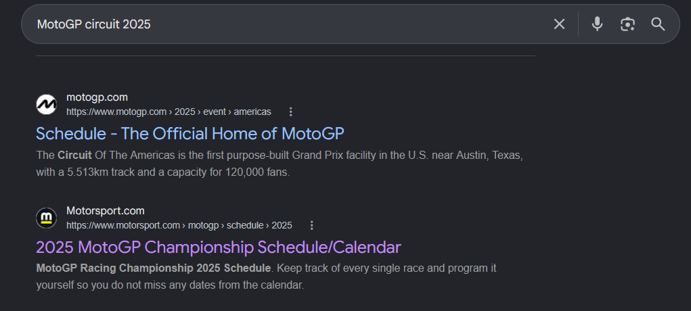
</p>

I opened the site and knew what timeline I was looking for, so I scrolled down to October. The races took place in Indonesia in October, so I clicked on the dropdown which gave me the event type, date and time of the events that took place.

<p align="center">
  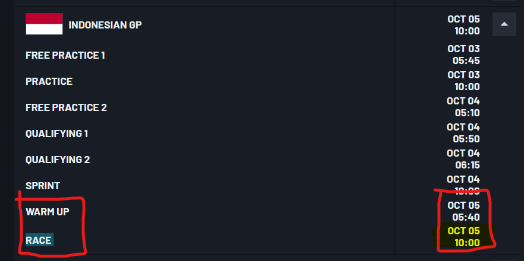
</p>

Now that I identified the location and date: I searched for "INDONESIAN GP 2025 OCTOBER 5 RACE" to capture the flag.

<p align="center">
  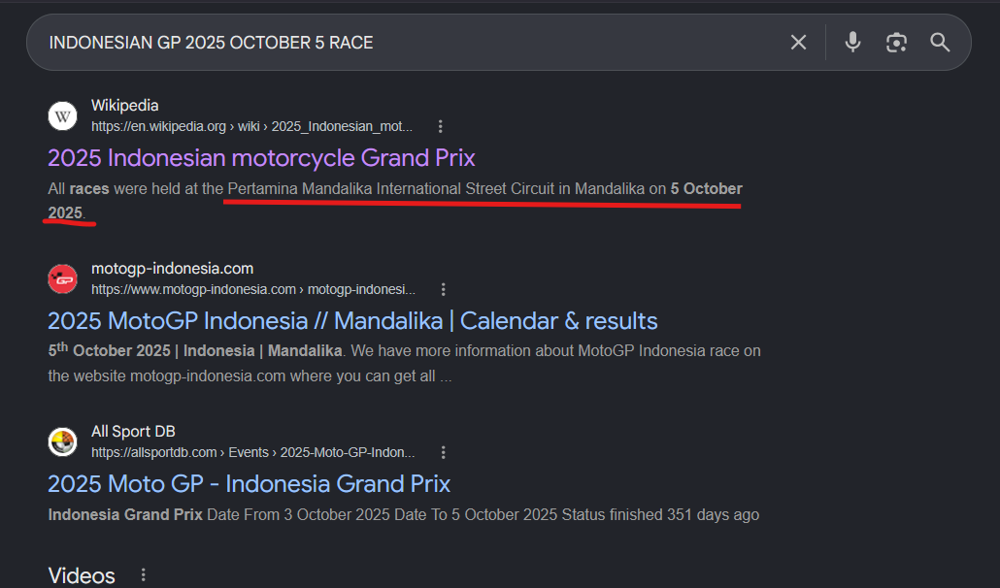
</p>

In the site description of the event wiki, the details of the circuit at which the event took place was mentioned. I opened the website to confirm the find.

<p align="center">
  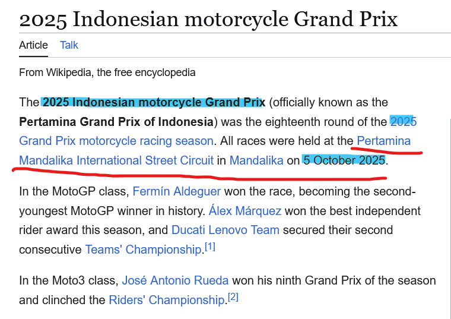
</p>

The first flag was 
```text
Pertamina Mandalika International Street Circuit
```

Now, looking at the second flag I had to find, we need to go back the schedule:

<p align="center">
  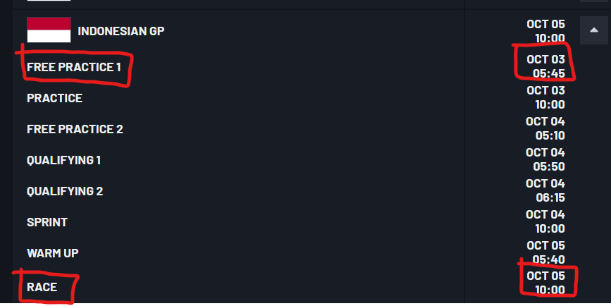
</p>

The schedule clearly contained the date of the first event and the last event. Hence the required flag was
```text
03-05/10/2025
```

---

### Flags 3 and 4

For flags 3 and 4, I needed to move onto the next image. I will embed the image again for the sake of not having to constantly scroll.

<p align="center">
  
</p>

After looking around for a while I noticed words on the table.


<p align="center">
  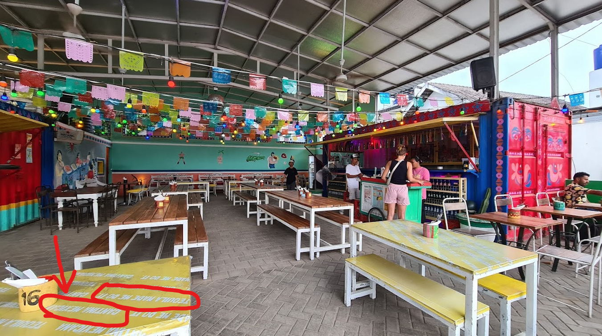
</p>

```text
Cantina Mexicana
```

Clearly the restaurant branding is on the table and after verifying on Google Maps, I had flag 3 as
```text
Cantina Mexicana
```

For flag 4, we just look at the metadata of the image using Exiftool

<p align="center">
  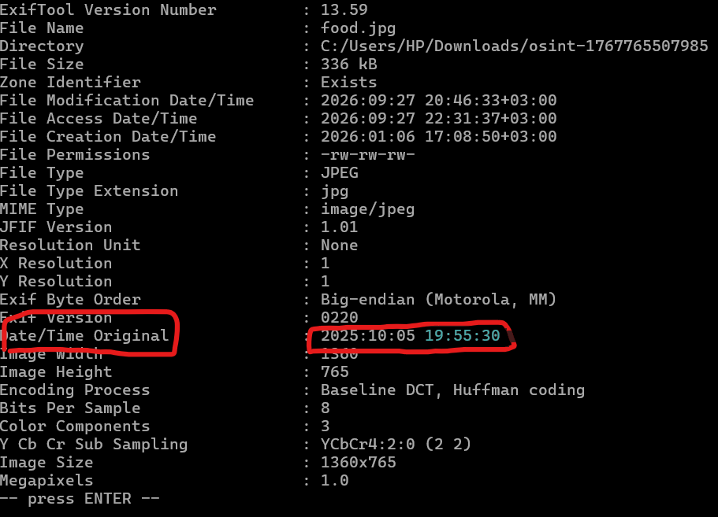
</p>

The time is in the metadata of the image under `Date/Time Original:`. Hence we have flag 4 as
```text
19:55:30
```

---

### Flags 5 and 6


For flags 5 and 6, a piece of text was given on the challenge page.
```text
He sent me a message, this is the last I heard from him: ”Went to this cool MotoGP after party, and became friends with one of the local DJs who played that night. We’re going to visit a cave tomorrow.”
```

The information I'm looking for is given in the message above. Using Google, i searched for "MotoGP After party october 5 2025" which gave me 3 top results. 


<p align="center">
  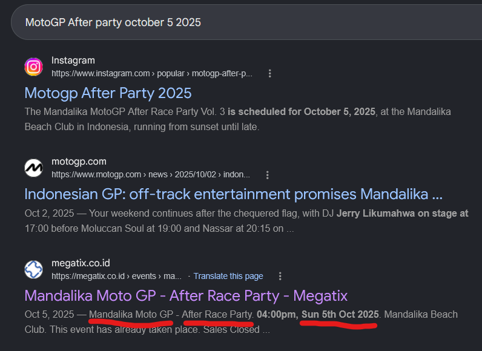
</p>

The megatix site had event details that strongly matched the event details which I got for flags 1 and 2. 

Upon visiting the site, I found the venue to the after party mentioned on the main page


<p align="center">
  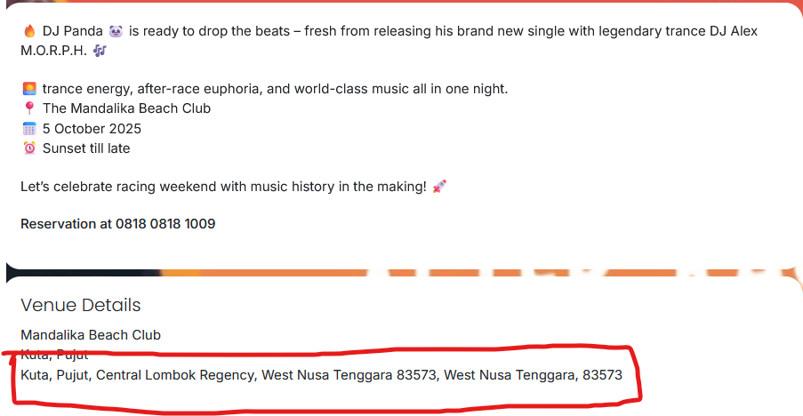
</p>

```text
Kuta, Pujut, Central Lombok Regency, West Nusa Tenggara 83573, West Nusa Tenggara, 83573
```

Now I knew where the event is taking place, I needed to find the name of bar where it took place and it's exact location. I proceeded with a Google search by searching for
```text
Bar at Kuta, Pujut, Central Lombok Regency, West Nusa Tenggara 83573, West Nusa Tenggara, 83573
```

3 locations came up from the search.

<p align="center">
  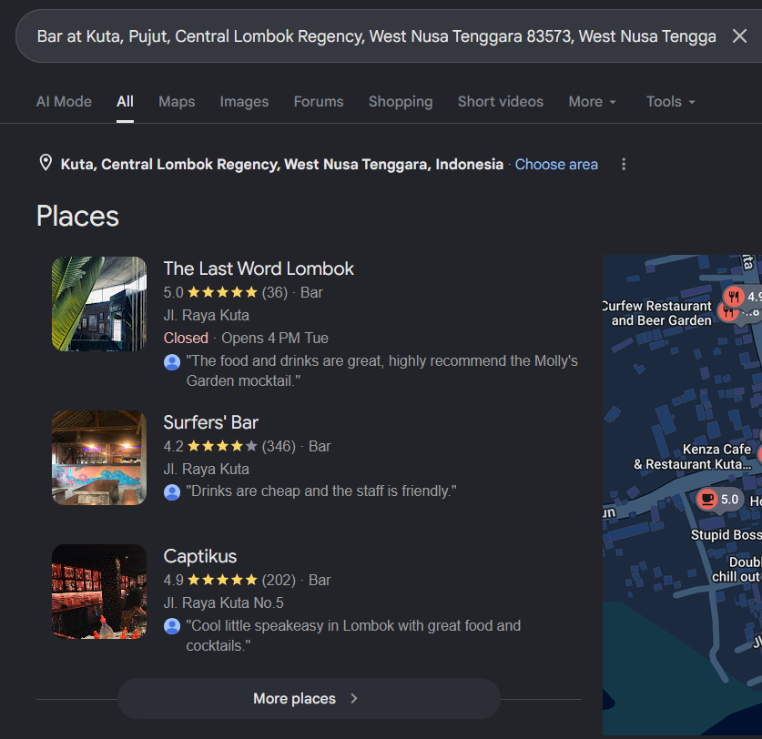
</p>

Upon surface level reviewing of the bars at the location, Surfer's bar stood out with a description "Bar offering live DJ sports and cocktails".

<p align="center">
  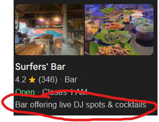
</p>

After suspecting the location, I made another search "Surfers bar MotoGP after party 2025", where I found Surfer's bar's Instagram post with the description which can be seen in the image below.

<p align="center">
  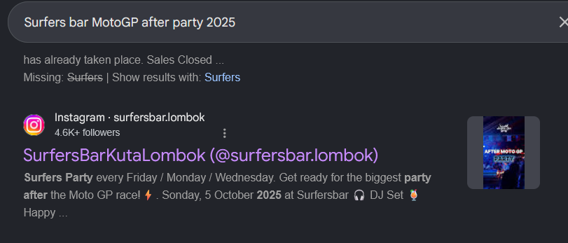
</p>

This confirm's the location was Surfer's bar. Going back to the locations we got, upon clicking the Surfer's bar, I had flag 5 as

<p align="center">
  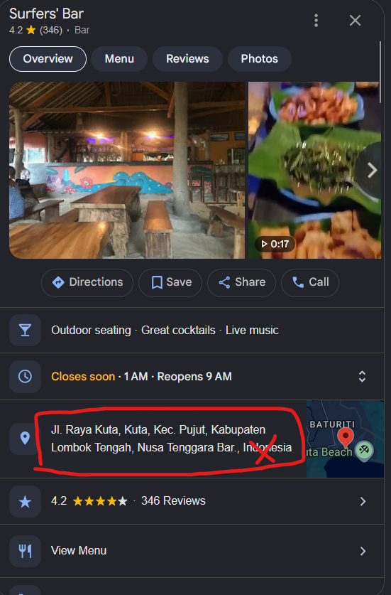
</p>

```text
Jl. Raya Kuta, Kuta, Kec. Pujut, Kabupaten Lombok Tengah, Nusa Tenggara Bar
```
*without "Indonesia" because of the flag format*

For flag 6, we go back to the Instagram post made by Surfer's bar. Watching the video in the post, the DJ's name is mentioned, where I had flag 6 as

<p align="center">
  
</p>

```text
Bong Leleh
```

### Flags 7 and 8

I then searched for caves near Surfer's bar on Google Maps. Which gave me 2 plausible answers.

<p align="center">
  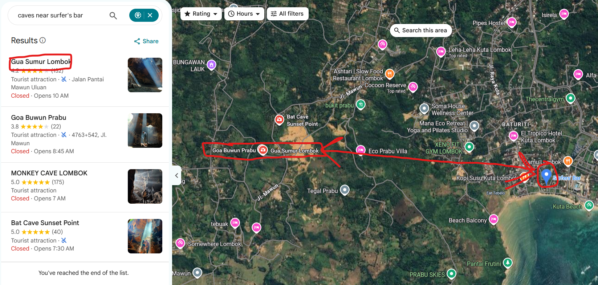
</p>

I first searched for "Gua Sumur Bong Leleh", after scrolling through search results I came across Bong Leleh's Facebook page with the cave name. The post confirmed that the cave I was looking for was Gua Sumur, and the post description also had the contact number for his tour business in the post description.

<p align="center">
  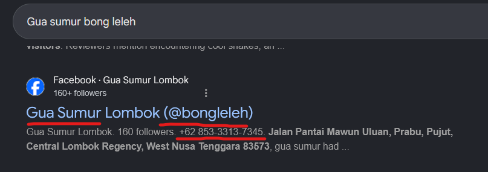
</p>

Now I had the final two flags as
```text
Gua Sumur
```
and
```text
85333137345
```

---

## Conclusion

I identified and verified all information i obtained. I submitted every flag and solved the CTF.

Major OSINT techniques that this CTF taught me:

- Image analysis
- Metadata analysis using ExifTool
- Search engine research
- Google Maps investigation
- Social media investigation
- Location verification
- Event research
- Cross reference verification

The main lesson to be taught from this CTF is that information you obtain should be verified before being finalized as evidence.
