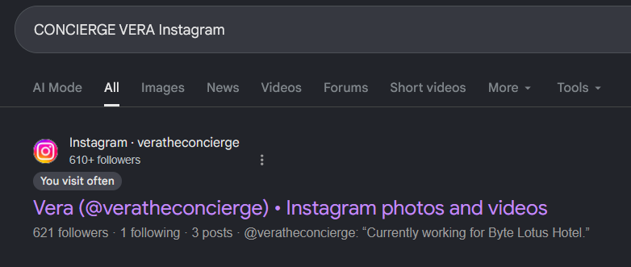
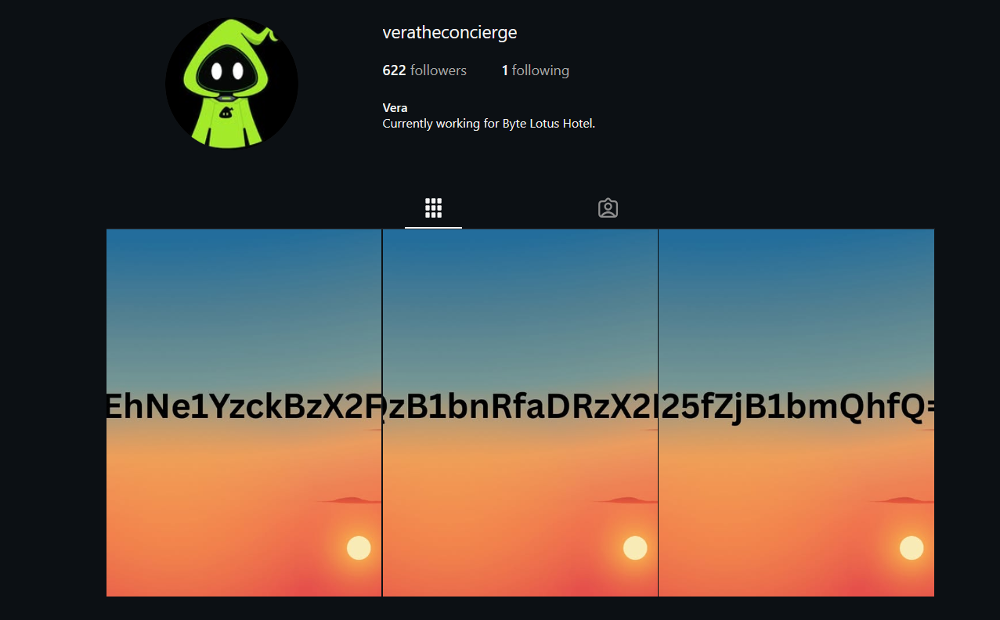
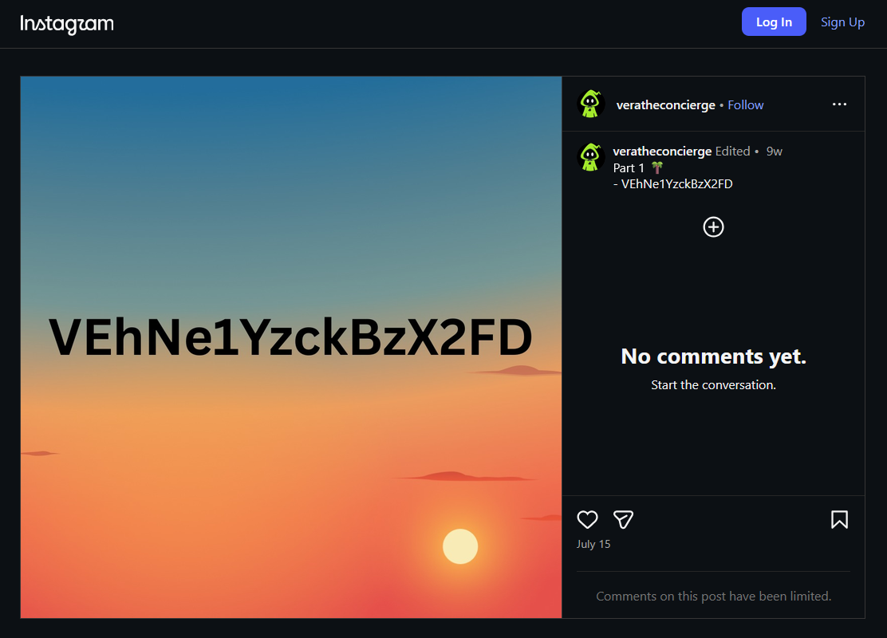
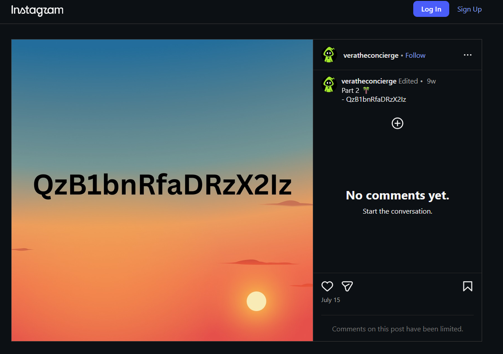
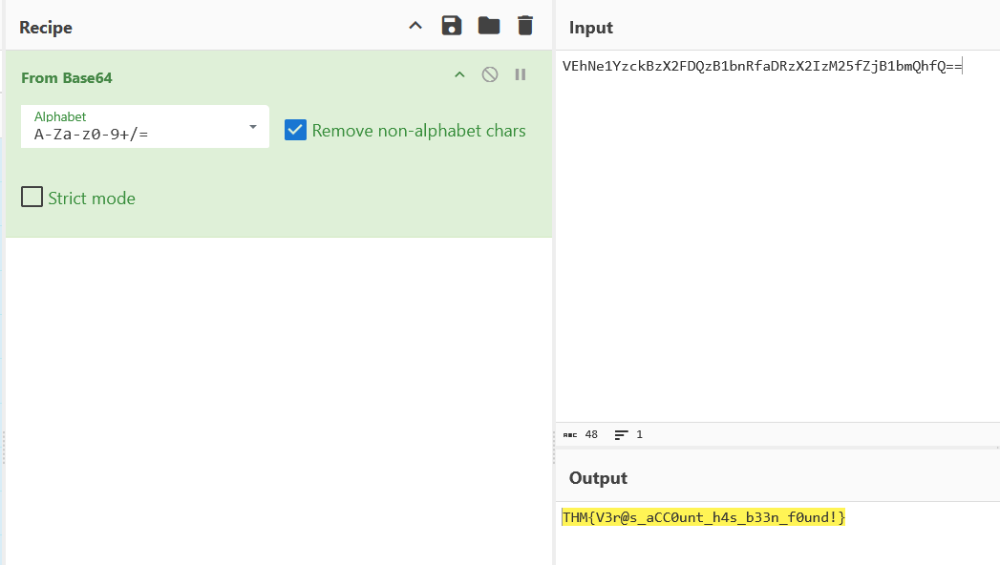

# [The Brochure](https://tryhackme.com/room/hh-thebrochure-081f3e36)

**Platform:** TryHackMe  
**CTF:** Hacker Holidays 2026 Day 3   
**Category:** OSINT/SOCINT    
**Difficulty:** Very Easy  
**Tools used:** Google

## Challenge information

Before you ever set foot on the property, you decide to do a little homework on the Byte Lotus Hotel. The brochure's hero photo carries an unmistakable AI fingerprint, and the account behind it leads somewhere the hotel never intended you to look.

Follow the trail, uncover the hidden connection, and find what was left behind.

*Task files were to be downloaded, which upon downloading gave below image*

<p align="center">
  
</p>


## Challenge Objective

- Analyze the provided image for embedded clues.
- Apply fundamental OSINT techniques to trace the findings.
- Locate the hidden social media account.
- Submit the flag.


## Initial Analysis

I first looked at the image and noticed a few words were colored differently than the base text color.

## Finding clues

The brochure had the words "trail", "Instagram" and "CONCIERGE" in gold as compared to other darkish blue colored text. Since the challenge objective said we needed to find a social media account, it was obvious that the account would be on Instagram.

## Finding the account and investigating further

Because the day 1 challenge was about VERA, the AI concierge and the word "CONCIERGE" being colored differently, I first searched
```text
CONCIERGE VERA Instagram
```
on google.

The top most site was an Instagram account.

<p align="center">
  
</p>

When I clicked on the link, the account was evidently related to the CTF. It was VERA's account. 

<p align="center">
  
</p>

The three and only posts on the account contained text:

<p align="center">
  
</p>

<p align="center">
  
</p>

<p align="center">
  
</p>

combining the text from each post in order gave
```text
VEhNe1YzckBzX2FDQzB1bnRfaDRzX2IzM25fZjB1bmQhfQ==
```

## Capturing the flag

Clearly the text obtained earlier was base64 encoded. So I opened cyberchef, pasted the text in the input and entered "From Base64" into the recipe. The decoded text gave mt the flag.

<p align="center">
  
</p>

```text
THM{V3r@s_aCC0unt_h4s_b33n_f0und!}
```


